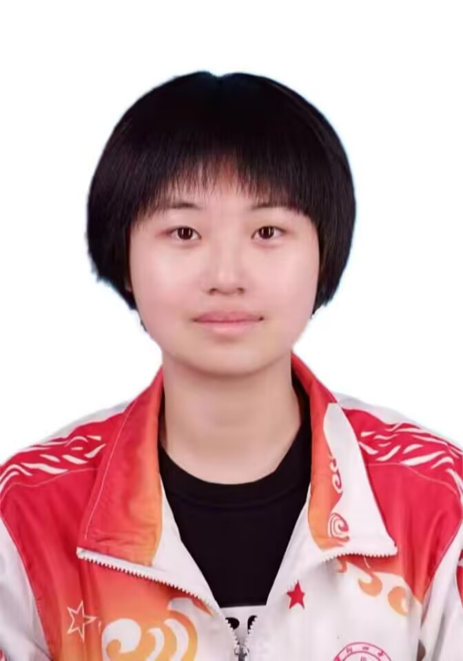

### **王毅婷**

------

### 个人介绍

王毅婷，华中师范大学本科生，计算机学院软件工程专业，主要研究方向包括：软件设计与开发

### 教育背景

------

2021年-今   华中师范大学本科生

### 学习课程

------

高等数学、离散数学、概率统计、线性代数、C语言、C++、数据结构、Java、算法设计与分析、计算机组成原理、计算机网络、数据库、软件构造、云计算、软件需求分析、人机交互、Web、信息检索等

### 学生工作经历

------

1.大一担任院学术与科技创新中心部委

2.大二担任院学术与科技创新中心部长、

3.大三担任院学生会主席

### 暑期社会实践

------

1.2023年暑期参与暑期支教，抵达宜昌秭归担任小学教师

2.2022年暑期参与红色文化实践活动，传承红色文化

### 获得奖项

------

1.2022年获得“运动会积极分子”

2.2021年获得“军训优秀学员”

3.普通话水平测试获得一级乙等

4.团干培训“优秀学员”

5.2021-2022年度获评“优秀部委”

6.2022-2023年度“优秀负责人”

7.2023年度校“优秀志愿者”

8.获得“中级软件设计师”资格证书
